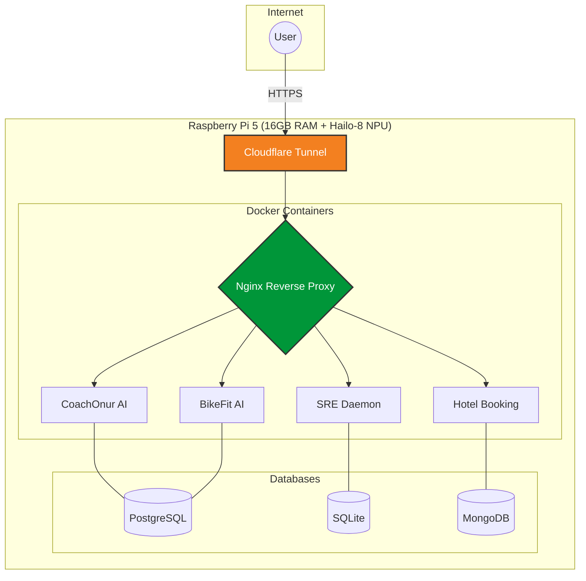

<div align="center">


### Software Engineer | Full-Stack & AI Product Development | Founder @ TriHonor

🚀 Building production AI, web, mobile & wearable products end-to-end
🛠️ React/React Native, TypeScript, Python/FastAPI, LLM Integration, Computer Vision, Garmin/Wearables
📍 Based in **Tampere, Finland** 🇫🇮
✅ Finnish permanent residence — full right to work, no sponsorship needed
💼 **Open to opportunities** — Full-time | Hybrid | Remote

[](https://portfolio2026-mu-tawny.vercel.app/)
[](https://www.linkedin.com/in/onur-kapucu/)
[](mailto:kapucuonur@hotmail.com)
[](https://medium.com/@kapucuonur)

</div>

---

## 👨‍💻 About Me

```javascript
const onur = {
    const onur = {
    location: "Tampere, Finland",
    role: "Software Engineer, Founder @ TriHonor",
    since: "2022",
    languages: ["Python", "TypeScript", "Swift", "Dart", "Monkey C"],
    coreStack: ["React/React Native", "FastAPI", "PostgreSQL", "Docker", "LLM Integration"],
    currentFocus: ["AI Product Engineering", "Native Mobile (React Native/Expo)", "Self-Hosted Infrastructure"],
    passion: "Taking AI products from idea to real, paying users.",
    infrastructure: "Raspberry Pi 5 + Hailo-8 NPU + Docker + Cloudflare Tunnels"
};
```

Full-stack software engineer shipping production applications across Web, Mobile, and Hardware. I build end to end — frontend, backend, infrastructure — and use agentic AI tooling (Claude Code, Cursor) daily as a core part of the workflow, not just autocomplete.

Founder of **TriHonor Oy**, a registered Finnish software company: 30+ shipped projects, two apps live on Google Play, 100+ paying subscribers across products.

---

## 🛠️ Tech Arsenal

### AI / ML


### Backend


### Frontend


### Mobile, Native & Wearables


-000000?style=for-the-badge&logo=garmin&logoColor=white)


### Databases


### Payments


### DevOps & Infrastructure


---

## 🌟 Featured Projects

<div align="center">

### 🚀 Production-Ready Applications

</div>

<table>
<tr>
<td width="50%" valign="top">

### 🏃‍♂️ [CoachOnur AI](https://www.coachonurai.com/)

**AI Coaching Platform**
Production AI coaching system: real-time Garmin sync (HRV, sleep, activity), Gemini-powered training decisions, Stripe subscriptions, native Android app. Native (React Native/Expo) mobile rewrite in progress.

**Tech:** React, React Native, FastAPI, PostgreSQL, Gemini, Stripe, Kotlin, Docker

[](https://www.coachonurai.com/)
[](https://github.com/kapucuonur/AI-Coach-Demo)
[](https://github.com/kapucuonur/ai-coach-native)

</td>
<td width="50%" valign="top">

### 🚴 [BikeFit AI](https://bike.coachonurai.com/)

**Computer-Vision Bike Fitting**

Real-time pose estimation (YOLOv8 on Hailo-8 NPU) converts camera input into centimeter-accurate bike-fit recommendations. Native Android app.

**Tech:** Python, FastAPI, React, YOLOv8, Hailo-8 NPU, Gemini, Kotlin

[](https://bike.coachonurai.com/)
[](https://github.com/kapucuonur/bikefit-Demo)

</td>
</tr>

<tr>
<td width="50%" valign="top">

### 🛠️ [SRE Daemon](https://sre.trihonor.com/)

**Autonomous Self-Healing Infrastructure Agent**

Watches systemd/Docker logs and metrics, diagnoses root cause via a multi-tier LLM cascade, repairs issues with sandboxed validation and human-in-the-loop approval. Running in production. Now a commercial SaaS.

**Tech:** Python, SQLite, systemd, Docker, multi-provider LLM fallback

[](https://sre.trihonor.com/)
[](https://github.com/kapucuonur/sre-daemon-demo)

</td>
<td width="50%" valign="top">

### 🖥️ [WatchToMac](https://2236586809450.gumroad.com/l/kdrbne)

**Native macOS Utility**

Solves Garmin file-transfer on Apple Silicon (M1/M2/M3) via low-level USB/MTP protocol implementation.

**Tech:** Swift, SwiftUI, AppKit, System Programming

[](https://2236586809450.gumroad.com/l/kdrbne)
[](https://github.com/kapucuonur/WatchToMac)

</td>
</tr>

<tr>
<td width="50%" valign="top">

### 🇫🇮 [Learn-Finnish.fi](https://learn-finnish.fi)

**AI-Powered Language Learning SaaS**

Personalized Finnish lessons generated via Gemini, 100+ active subscribers, Stripe billing.

**Tech:** Next.js, React, Gemini API, Stripe, Firebase

[](https://learn-finnish.fi)
[](https://github.com/kapucuonur/LearnFinnish)

</td>
<td width="50%" valign="top">

### 🏨 [Hotel Booking System](https://hotel.trihonor.com/)

**Full-Stack Reservation Platform**

Real-time availability tracking, Dockerized deployment, Cloudflare Tunnel routing, self-hosted on Raspberry Pi 5.

**Tech:** React, Node.js/Express, MongoDB, Docker, Nginx, TailwindCSS

[](https://hotel.trihonor.com)
[](https://github.com/kapucuonur/hotel-booking-app)

</td>
</tr>
</table>

---

## 🏗️ Self-Hosted Infrastructure

<div align="center">



</div>

**Production Stack Running on Pi 5:**
- 🐳 Docker + Portainer for container orchestration
- 🌐 Nginx reverse proxy routing
- ☁️ Cloudflare Tunnels for secure external access — zero exposed ports
- 🚀 Git-based auto-deploy
- 🤖 SRE Daemon: autonomous self-healing agent monitoring the whole stack

---

## 📂 Additional Projects

<details>
<summary><b>🔽 Earlier / learning-stage projects</b></summary>

<br>

| Project | Tech Stack | Live Demo |
|---------|-----------|-----------|
| **[Ice Bath Tracker](https://github.com/kapucuonur/IceBath)** | Monkey C • Garmin CIQ SDK • Wearable Sensor API | [🔗 Live](https://apps-developer.garmin.com/apps/9d9633a0-51a9-48c3-8fad-44de0e4277fc) |
| **[Digilibrary](https://github.com/kapucuonur/digilibrary-app)** | React • Node.js • MongoDB • Google AI • Stripe | [🔗 Live](https://digilibray.netlify.app/) |
| **[DevChatbot-AI](https://github.com/kapucuonur/DevChatbot-AI)** | React • Flask • TensorFlow • Groq API | [🔗 Live](https://devchatbot-ai.onrender.com/) |
| **[FullStack-StockApp](https://github.com/kapucuonur/FullStack_StockApp)** | React • Redux • Node.js • Express • MongoDB | [🔗 Live](https://fullstack-stockapp-outp.onrender.com/) |
| **[Blog-App-Python](https://github.com/kapucuonur/Blog_App_Python)** | Django • React • PostgreSQL | [🔗 Live](https://blog.trihonor.com/) |
| **[ai-content-generator](https://github.com/kapucuonur/ai-content-gerator)** | React • Vite • Gemini API | [🔗 Live](https://contentgeneratorappai.netlify.app/) |

*Full history of 30+ repos available on my [GitHub repositories tab](https://github.com/kapucuonur?tab=repositories).*

</details>

---

## 📊 GitHub Analytics

<p align="center">
  
</p>

<p align="center">
  
  
</p>

<p align="center">
  
</p>

---

## 💼 What I Offer

```yaml
Engineering Capabilities:
  - AI/ML Integration: LLMs, Gemini, OpenAI, Groq, RLHF, agentic tooling
  - Computer Vision: YOLOv8, pose estimation, Hailo NPU
  - Full Stack Web: React, FastAPI, Node.js, PostgreSQL
  - Mobile & Native: Kotlin/Android, Swift/macOS, Flutter
  - Wearable Tech: Garmin Connect IQ (Monkey C)
  - DevOps & Infrastructure: Docker, Nginx, Cloudflare Tunnels, self-hosting
  - Cloud: Microsoft Azure (certified), Firebase, Vercel

Infrastructure Expertise:
  - Self-hosted production environments (Raspberry Pi 5 + Hailo-8 NPU)
  - Docker containerization & orchestration
  - Autonomous self-healing infra (SRE Daemon)
  - Git-based auto-deployment pipelines
```

---

## 🎯 Currently

- 🏗️ **Building:** Garmin Connect IQ sports app, growing SRE Daemon into a commercial SaaS
- 🌱 **Learning:** Finnish (B1, actively studying via Metropolia coursework)
- 👯 **Looking to collaborate on:** AI product engineering, agentic tooling, wearable tech
- 💼 **Open to:** Full-time Software/AI Engineering roles (Tampere, hybrid, or remote)
- 🌐 **Portfolio:** [portfolio2026-mu-tawny.vercel.app](https://portfolio2026-mu-tawny.vercel.app/)
- 📫 **Reach me:** kapucuonur@hotmail.com

---

## 🏆 Key Achievements

```diff
+ Founded TriHonor Oy — 30+ shipped production applications
+ Two native Android apps live on Google Play (CoachOnur AI, BikeFit AI)
+ Grew AI coaching platform to 100+ paying subscribers
+ Built autonomous self-healing SRE agent, now a commercial SaaS product
+ Architected self-hosted infrastructure (Pi 5 + Hailo NPU), zero unplanned downtime
+ Native macOS utility solving critical M1/M2/M3 compatibility issues
```

---

## 📫 Let's Connect!

<div align="center">

[](https://portfolio2026-mu-tawny.vercel.app/)
[](https://www.linkedin.com/in/onur-kapucu/)
[](https://github.com/kapucuonur)
[](https://medium.com/@kapucuonur)
[](mailto:kapucuonur@hotmail.com)

**💬 I usually respond within 24 hours**

</div>

---

## 💖 Support My Work

<div align="center">

If you find my projects helpful, consider supporting me:

[](https://buymeacoffee.com/onurbenn9)

</div>

---

<div align="center">

### "Code is like humor. When you have to explain it, it's bad." – Cory House


**⭐ Star my repos if you find them interesting!**

Made with ❤️ in Tampere, Finland 🇫🇮

</div>
